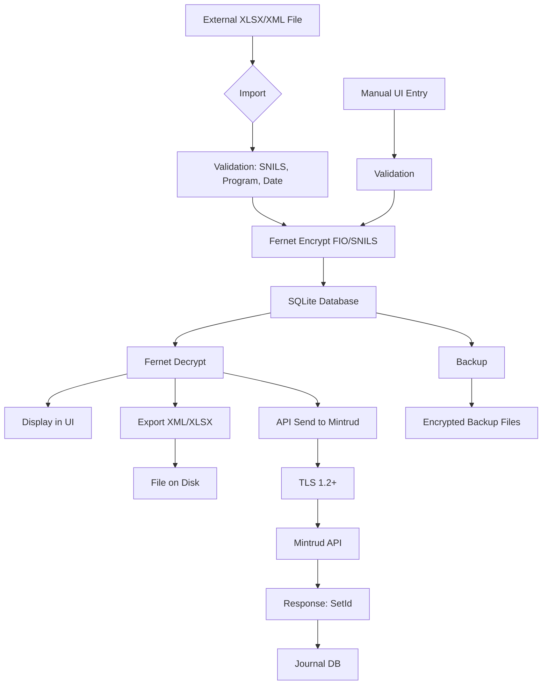
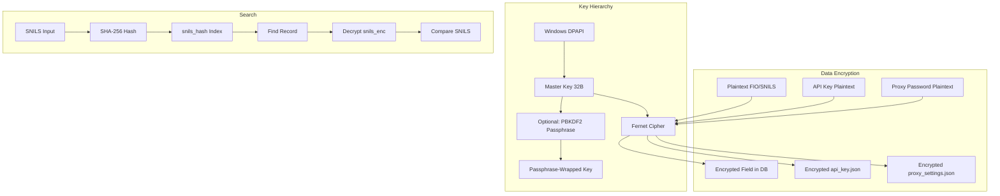
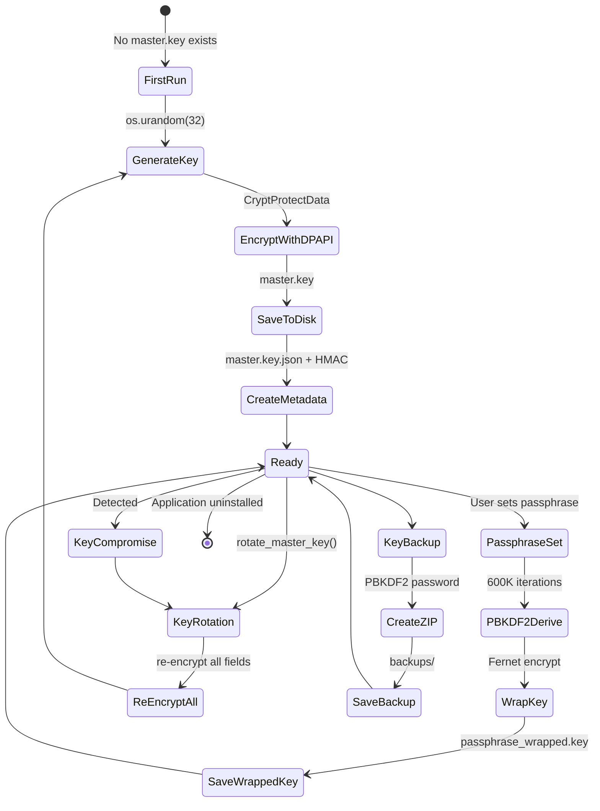
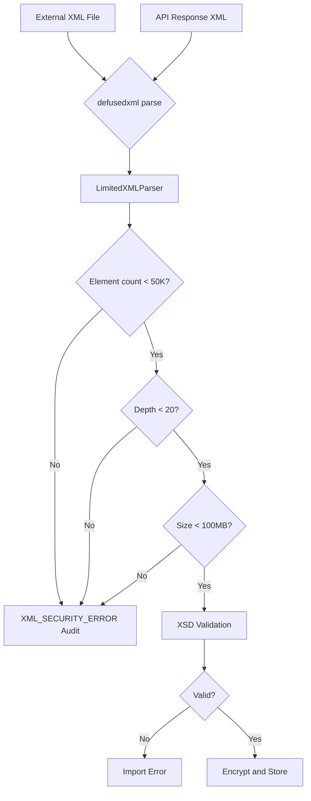

# Руководство по операционной безопасности ИСПДн

**Проект:** Excel_to_XML
**Версия:** 3.0.0
**Дата:** 21.05.2026

## 1. Data Flow Diagrams

### 1.1. Overall Data Flow



### 1.2. Encryption Flow



### 1.3. Secrets Lifecycle



### 1.4. XML Processing Flow



## 2. Backup Management

### 2.1. Automatic Backup
- Trigger: application startup
- Method: `shutil.copy2` of `app_data.db`
- Retention: max 5 copies (rotation: oldest deleted)
- Location: `%APPDATA%/Excel_to_XML/backups/`
- Encryption: data already encrypted at field level

### 2.2. Manual Key Backup
- Trigger: menu → Backup
- Method: ZIP archive with PBKDF2-derived password
- Contents: `master.key`, `master.key.json`, `passphrase_wrapped.key`
- Password derivation: `PBKDF2(master_key, salt=b"key_backup", iterations=100000)`
- Storage: external encrypted media recommended

### 2.3. Backup Rotation
```python
# Retention logic
backup_files = sorted(glob("backups/app_data.db.backup.*"))
while len(backup_files) >= 5:
    os.remove(backup_files.pop(0))
```

### 2.4. Recovery Procedure
1. Locate the latest clean backup
2. Copy `app_data.db.backup.N` to `app_data.db`
3. If master key also lost: restore from key backup ZIP
4. Run application — verify data readable
5. Check audit log for consistency

## 3. Key Management

### 3.1. Master Key Rotation

When to rotate:
- Suspected compromise
- Passphrase changed
- Operator leaves organization
- Every 12 months (recommended)

Procedure:
1. Menu → Backup (create backup first)
2. Application triggers `rotate_master_key()`
3. New key generated via `os.urandom(32)`
4. All fields re-encrypted with new key
5. Old key securely deleted
6. New key backup created automatically
7. Verify: all data readable after rotation

### 3.2. Passphrase Change

When to change:
- Every 90 days (recommended)
- Suspected disclosure
- Operator leaves

Procedure:
1. Menu → Settings → Change passphrase
2. Enter old passphrase
3. Enter new passphrase (min 12 chars)
4. Application re-wraps master key with new passphrase
5. Old passphrase-wrapped key deleted
6. Verify: can unlock with new passphrase

### 3.3. Key Recovery (lost key)

Scenario: master.key file is lost/corrupted, no backup

1. ❌ Data is PERMANENTLY LOST if no key backup exists
2. This is by design — no backdoor, no master password
3. Prevent: always maintain key backup on separate media
4. Prevent: use passphrase (easier to remember than 32-byte key)

Scenario: passphrase forgotten

1. ❌ Cannot recover master key without passphrase
2. Only if key backup exists (key backup uses different PBKDF2 derivation)
3. Restore from key backup ZIP → enter backup password → recover master key → set new passphrase
4. Prevent: store backup password in password manager

## 4. Incident Response

### 4.1. Incident Classification

| Level | Description | Example | Response Time |
|-------|-------------|---------|---------------|
| L1 | Minor | Failed login attempt, TLS warning | 24h |
| L2 | Moderate | Suspicious export, API error | 4h |
| L3 | Major | Possible data breach, key compromise | 1h |
| L4 | Critical | Confirmed breach, ransomware | Immediate |

### 4.2. Incident Response Procedure

```
Step 1: DETECT
- Automated: audit log events, Windows event log
- Manual: operator report, routine log review
→ Output: incident notification

Step 2: ISOLATE
- Disconnect workstation from network
- Disable Wi-Fi/Ethernet
- Lock session (Win+L)
→ Output: containment achieved

Step 3: COLLECT EVIDENCE
Collect to external media (USB, network share):
- %APPDATA%/Excel_to_XML/log/*.log
- %APPDATA%/Excel_to_XML/backups/ (latest)
- %APPDATA%/Excel_to_XML/master.key
- %APPDATA%/Excel_to_XML/master.key.json
- System event logs (Security, Application)
- Memory dump (if forensic capability available)
→ Output: forensic copy

Step 4: ANALYZE
- Determine scope: which records, how many subjects
- Determine vector: how did the incident occur
- Determine timeline: start time, duration
- Determine impact: data exposed, data modified
→ Output: incident report

Step 5: NOTIFY
Within 24h (preliminary) / 72h (full):
- Roskomnadzor (Роскомнадзор) — 152-ФЗ ст.21
- Affected data subjects (работники)
- Mintrud (Минтруд) — if sent data may be compromised
- Organization management
→ Output: notification letters

Step 6: RECOVER
- Restore from clean backup
- Rotate master key (KEY_ROTATION)
- Change API key (via edu.rosmintrud.ru cabinet)
- Change passphrase
- Change Windows password
→ Output: system operational

Step 7: POST-MORTEM
- Root cause analysis
- Update threat model
- Update risk register
- Implement additional controls
- Update this guide
→ Output: post-incident report
```

### 4.3. Communication Plan

| Stakeholder | When | What |
|-------------|------|------|
| Internal IT | Immediate | Incident details, affected systems |
| Management | 1h | Business impact, legal exposure |
| Roskomnadzor | 24h | Preliminary notification (form TBD) |
| Roskomnadzor | 72h | Full notification with breach details |
| Data subjects | 72h | What data was exposed, what to do |
| Mintrud | 72h | If API data may be compromised |
| Law enforcement | If required | Evidence package |

## 5. Access Revocation

### 5.1. Operator Leaves Organization
1. Change passphrase (immediately)
2. Change API key (immediately)
3. Change Windows password
4. Review audit log for last N days of operator activity
5. Consider key rotation if suspicious activity found

### 5.2. Lost/Stolen Workstation
1. If BitLocker enabled: recovery key required to access data
2. Change API key (immediately)
3. Change all passwords associated with this workstation
4. Incident investigation: could data have been accessed?
5. Notify Roskomnadzor if breach confirmed

## 6. Operational Security Checklist (Monthly)

- [ ] Master key integrity check (verify HMAC)
- [ ] Audit log integrity check (verify HMAC tags)
- [ ] Backup rotation: max 5 copies confirmed
- [ ] Offsite backup created (external media)
- [ ] Passphrase changed (if 90 days since last change)
- [ ] API key rotated (if 90 days or suspected)
- [ ] Windows Update check: all updates installed
- [ ] Antivirus: definitions up to date, scan clean
- [ ] Logs reviewed for suspicious activity
- [ ] pip-audit: no CVEs in dependencies
- [ ] HARDENING.md checklist reviewed
- [ ] Incident response plan reviewed with team
